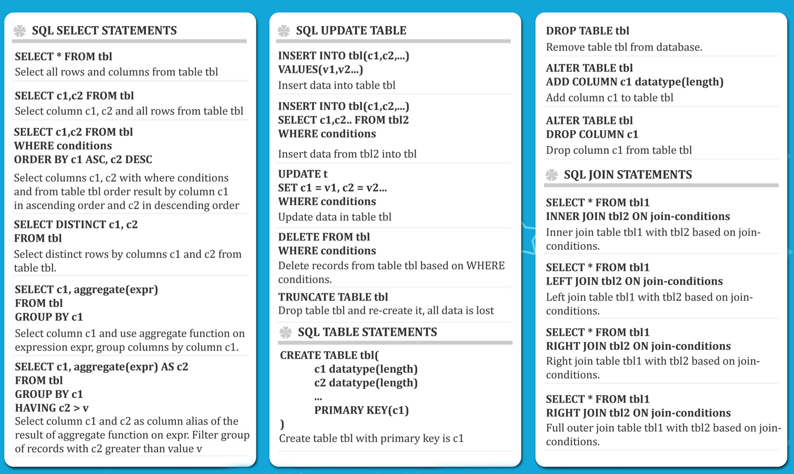

# The complete SQL Bootcamp

Files and exercises from Udemy course [The Complete SQL Bootcamp](https://www.udemy.com/course/the-complete-sql-bootcamp/)

## Environment Set Up using Docker

1. Create a volume and copy the `.tar` file to restore the database:
```commandline
docker volume create dbdata
sudo cp dvdrental.tar /var/lib/docker/volumes/dbdata/_data
```

2. Initialize the container with a postgres image:
```commandline
docker container run -d -p 5435:5432 --name pgsql --mount type=volume,src=dbdata,dst=/data -e POSTGRES_PASSWORD=postgres postgres:15.2
```

3. Enter the running container:
```commandline
docker exec -it pgsql bash
```

4. Create empty database `dvdrental`
```commandline
su -l postgres -c psql
CREATE DATABASE dvdrental;
\q
```
5. Restore the database from the `.tar` file:
```commandline
su -l postgres
pg_restore -c -U postgres -d dvdrental "/data/dvdrental.tar"
```

After that, your can use a database manager like [DBeaver](https://dbeaver.io/download/) to create a connection with the running container with  postgres and execute the SQL commands of this course. 


## SQL Cheatsheet (statements)

